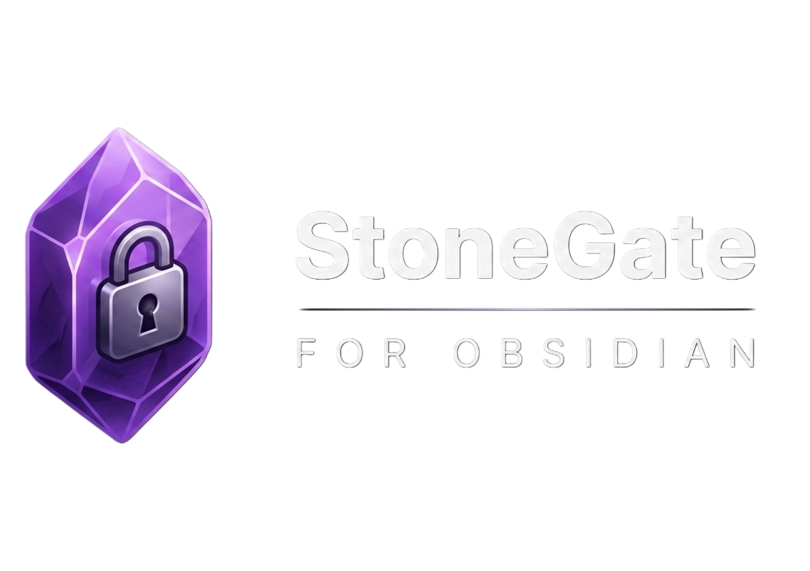
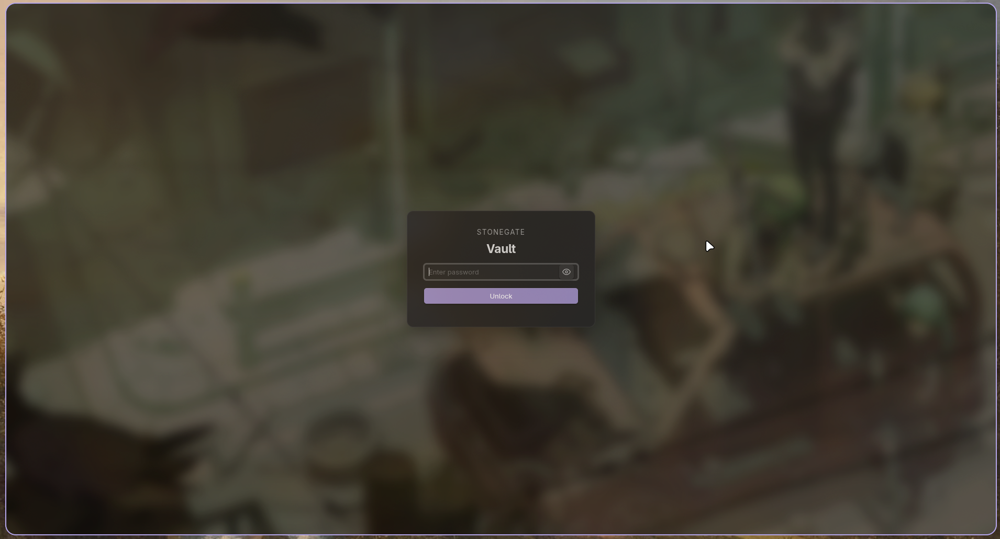

  

  <strong>Lock screen and vault protection for Obsidian, built on top of your password.</strong>

  
  
  

---

StoneGate protects your Obsidian vault and individual folders with password authentication, idle timeouts, brute-force lockouts, and an optional stealth mode that hides protected folders entirely.

  

## 🚀 Features

| Feature | Description |
|---|---|
| **Vault & Folder Protection** | Lock your entire vault or specific sensitive folders, each with its own password. |
| **Idle Timeout** | Automatically re-lock a path after a configurable period of inactivity. |
| **Persistent Lockout** | Blocks further attempts for a cooldown period after repeated failed passwords. |
| **Emergency Recovery** | Generate a one-time recovery code to regain access if you forget your password. |
| **Ghost Mode** | Hide protected folders from the File Explorer entirely until unlocked. |
| **Custom Backgrounds** | Set a custom lock screen background from a URL or a file in your vault. |

## 🛠 Installation

**From Community Plugins (recommended)**

1. Open Obsidian's **Settings → Community plugins**.
2. Make sure **Restricted mode** is turned off.
3. Click **Browse** and search for "StoneGate".
4. Click **Install**, then **Enable** the plugin.

**Manual installation**

1. Download `main.js`, `manifest.json`, and `styles.css` from the [latest release](https://github.com/xsiphr/StoneGate-plugin/releases/latest).
2. Create a folder named `stonegate` inside your vault's `.obsidian/plugins/` directory.
3. Copy the three downloaded files into that folder.
4. Reload Obsidian and enable StoneGate from **Settings → Community plugins**.

## ⚙️ Configuration

- **Master Password** — set in the plugin's settings tab to enable base vault protection.
- **Per-folder passwords** — add a protected path and give it its own password, independent of the master password.
- **Recovery Code** — generate under "Recovery Options." Keep this code offline; it's the only way back in if you forget your password.
- **Ghost Mode** — when enabled on a path, that folder disappears from the File Explorer while locked. Reach it via the Command Palette (`StoneGate: Unlock hidden/locked path`).

## ⌨️ Hotkeys

Configure these under **Settings → Hotkeys**:

- **Lock vault now** — manually trigger the lock screen.
- **Lock current folder** — lock just the folder containing the active file.
- **Unlock hidden/locked path** — open the menu to find and unlock a protected or hidden path.

## 🛡 Security Practices

- **Hashing** — passwords and recovery codes are hashed with PBKDF2 (SHA-256, 200,000 iterations) via the Web Crypto API, each with a unique random salt.
- **Local only** — all secrets stay on your device. Nothing is transmitted to an external server.
- **Defense in depth** — for sensitive vaults, pair StoneGate with system-level encryption (e.g. Cryptomator) rather than relying on it alone.

## 📝 License

MIT — see [LICENSE](LICENSE).

Built by [Abdulrahman Agiba (xsiphr)](https://github.com/xsiphr).
